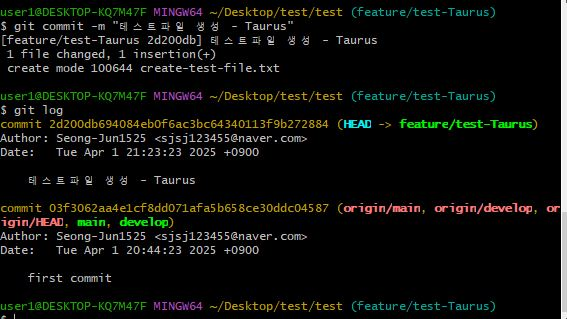

# 여행다섯시 Git 가이드 문서

> 작성자 : [임성준](https://www.github.com/Seong-Jun1525)

- ✅ [Git 명령어 모음](#git명령어-모음)
- ✅ [팀 브랜치 전략 구조](#-여행다섯시-브랜치-전략-구조)
- ✅ [프로젝트 git 작업 순서](#프로젝트-git-작업-순서)

---

## 📝 git명령어-모음

> [상단으로](#여행다섯시-git-가이드-문서)

| 설명                                                                             | 명령어                                                                    |
| -------------------------------------------------------------------------------- | ------------------------------------------------------------------------- |
| 원격저장소의 내용을 새로운 폴더에 그대로 복사                                    | `git clone`                                                               |
| 브랜치 목록 보기                                                                 | `git branch`                                                              |
| 브랜치 이동                                                                      | `git checkout 브랜치명`                                                   |
| 브랜치 생성                                                                      | `git checkout -b 브랜치명`                                                |
| 로컬 브랜치 삭제                                                                 | `git branch -d 브랜치명`                                                  |
| 원격 브랜치 삭제                                                                 | `git push --delete origin 브랜치명`                                       |
| 스태이징                                                                         | `git add . (변경사항 모두 반영)`                                          |
| 변경사항 모두 삭제                                                               | `git reset --hard`                                                        |
| 브랜치 이동                                                                      | `git checkout 브랜치명`                                                   |
| 브랜치 이동                                                                      | `git checkout 브랜치명`                                                   |
| 커밋기록확인                                                                     | `git log` ➡️ 커밋만 나옴<br>git reflog ➡️ 모든 상태 다 나옴(좀 더 자세함) |
| 현재 상태 확인                                                                   | `git status`                                                              |
| 커밋하기                                                                         | `git commit -m "커밋메시지"`                                              |
| 로컬 저장소의 변경 이력 원격저장소로 올리기                                      | `git push origin 브랜치명`                                                |
| 원격저장소에 있는 프로젝트의 변경사항을 그대로 로컬저장소에 옮겨와 자동으로 병합 | `git pull`                                                                |

✅ [git 공식 문서 바로가기](https://git-scm.com/docs)

✅ [git 설명 관련 참고영상](https://youtu.be/lelVripbt2M?si=saaMpM-p9pCgJrh4)

✅ [git 팀 프로젝트 관련 참고영상](https://youtu.be/tkkbYCajCjM?si=euS92sec8kEMb0Ko)

---

## 🔀 여행다섯시 브랜치 전략 구조

> [상단으로](#여행다섯시-git-가이드-문서)

```bash
main
└── develop
    ├── develop/team기능카테고리명
    │   ├── feature/기능명-닉네임
    │       ...
    ├── develop/team기능카테고리명
    │   ├── feature/기능명-닉네임
    │       ...
    ├── develop/team기능카테고리명
    │   ├── feature/기능명-닉네임
    │       ...
    └── develop/team기능카테고리명
       ├── feature/기능명-닉네임
            ...
```

### 📌 브랜치 구조 설명 & 브랜치명 생성 규칙

- `main`

  - 최종 배포 버전이 반영되는 브랜치. 안정성과 완성도를 보장해야 함. 직접 커밋은 하지 않고 PR을 통해서만 병합

- `develop`

  - 전체 프로젝트의 통합 개발 브랜치. 모든 팀의 개발 결과물을 통합 및 테스트하는 용도

- `develop/team기능카테고리명` (🔥규칙🔥)

  - 각 팀별 개발 환경 브랜치. 기능 단위로 세분화된 브랜치들을 이 브랜치 기준으로 관리

- `feature/기능명-닉네임` (🔥규칙🔥)
  - 실질적인 기능 구현이 이루어지는 브랜치. 팀원들은 해당 브랜치를 기반으로 개발 후 `develop/team기능카테고리명`으로 PR 요청

### 🎯 왜 이렇게 구성하는가?

> [상단으로](#여행다섯시-git-가이드-문서)

> 각 기능을 카테고리별로 구분하여 팀을 나누고 각 팀이 독립적으로 개발할 수 있도록 하기 위함

```
✅ 기능 단위 팀 운영으로 병렬 개발 가능

✅ 파트별 브랜치만 pull/merge하여 타 팀 입장에서 불필요한 변경사항 반영 X

✅ 병합 충돌 최소화

✅ 브랜치 기반 역할 분담이 명확하여 협업 효율 증가
```

### 💡 브랜치 관리 흐름

> [상단으로](#여행다섯시-git-가이드-문서)

1️⃣ `develop` 브랜치 ➡️ `develop/team기능카테고리명` 브랜치 생성

2️⃣ `develop/team기능카테고리명` ➡️ `feature/기능명-닉네임` 기능 브랜치 생성

3️⃣ 기능 개발 완료 ➡️ `develop/team기능카테고리명`으로 병합

4️⃣ 팀 단위 테스트 완료 ➡️ `develop`으로 병합

5️⃣ 전체 통합 완료 ➡️ `main`으로 병합

---

## 🔁 프로젝트 git 작업 순서

### 🔧 준비작업

> [상단으로](#여행다섯시-git-가이드-문서)

- 컴퓨터에 git 계정 설정하기
- 프로젝트를 작업할 작업공간(Workspace) 폴더 만들기
- 작업공간 폴더로 열기

### 🗂️ 1. 프로젝트 복사하기

> [상단으로](#여행다섯시-git-가이드-문서)

```
github의 팀 리포지토리 ➡️ 현재 브렌치 상태 확인 후 ➡️ Code ➡️ 링크 복사!

* 여기서는 TEST 이므로 test Repository 생성 후 진행
* 팀원은 반드시 팀 리포지토리에서 진행하길 바람!!!
```


```
작업공간 폴더에서 git bash 실행 ➡️ 명령어 입력해서 프로젝트 복사하기!

* 여기선 TEST이므로 test 작업공간 생성 후 진행
```


- 위의 사진 설명

```
✅ 1. 작업공간에서 git bash를 실행시킨다.

✅ 2. 아래 명령어를 통해 프로젝트를 복사한다.

✅ 3. 복사한 프로젝트로 경로를 이동한다.
```

> 명령어 : `git clone 리포지토리 주소`

---

### 🔀 2. 브랜치 확인 후 develop 브랜치로 이동하기

> [상단으로](#여행다섯시-git-가이드-문서)

> ✅ 프로젝트 경로로 이동하면 경로 우측에 (현재브랜치명) 이 파란색 확인

```
처음은 main 브랜치이다.

git branch 명령을 했을 때 develop이 목록에 없다. 하지만 Github의 리포지토리에서
브랜치 버튼을 클릭 해볼 시 현재 원격에 올라온 브랜치 목록을 확인할 수 있다.
```

> 기본적으로는 master이지만 `git branch -M main` 명령을 통해 강제로 변경했으므로 main인 것이다.


#### develop 브랜치로 이동하기 `git checkout develop`


```
✅ checkout 명령어로 develop 브랜치로 이동

✅ git branch 명령어로 브랜치 목록을 조회하면

✅ develop 브랜치가 있는 것을 확인할 수 있다
```

#### 각 팀 개발 브랜치로 이동 `git checkout develop/team기능카테고리명`

```
앞서 설명했듯이 develop 하위에 파트 별 develop 브랜치가 있으므로

해당 파트 개발 브랜치로 이동 하기
```

> 각 팀 별 브랜치로 checkout 하기

---

### 🚀 3. 기능 브랜치 생성하기

> [상단으로](#여행다섯시-git-가이드-문서)

> 반드시 현재 브랜치가 develop인 상태에서 진행할 것!

```
✅ 현재 브랜치 상태가 develop인 것을 확인했다면 이제 기능 브랜치를 생성해야한다.
```

> 기능 브랜치 생성하기 `git checkout -b feature/기능명-담당자닉네임`

```
앞서 설명했듯이 우리 프로젝트의 기능 브랜치 생성 규칙은 다음과 같다

🔥feature/개발할기능명-담당자닉네임🔥

ex) feature/memberLogin-Taurus
```


```
위의 사진처럼 git checkout -b 기능브랜치명 명령어를 실행하면
해당 브랜치를 생성 후 해당 브랜치로 이동되는 것을 확인할 수 있다!
```

---

### **여기까지 했으면 이 상태에서 프로젝트 작업하기**

---

### ✨ 4. 변경사항 확인 후 추가하기

> [상단으로](#여행다섯시-git-가이드-문서)

```
프로젝트를 작업하기 전과 후에 항상 해야할 것이 변경사항을 확인하는 것이다.
```

#### ✅ `git status` 명령어로 변경 사항 확인하기!


```
작업 후 git status 명령어를 실행하면 위의 사진처럼
빨간 텍스트로 변경된 내용이 출력될 것이다.

* 추가로
modified : 수정된 파일
deleted : 삭제된 파일
```

#### `git add .` 명령어로 변경 사항 모두 추가하기!


```
* git add 이후 해야할 사항은 반드시 git status로 모두 반영되었는지 확인할 것!
```

---

### 📝 5. 변경사항 로컬에 기록 하기

> [상단으로](#여행다섯시-git-가이드-문서)

```
변경사항을 추가했다면 이제 로컬에 기록해야 한다.
```

#### `git commit -m "커밋 메시지"` 명령어로 변경사항 기록 하기



```
git add 명령어를 실행 후 잘 추가가 되었을 시 commit 명령어로 기록해야한다.

우리 프로젝트의 커밋메시지 규칙은 다음과 같다

git commit -m "작업내용 - 닉네임"

* 작업내용은 간단히 작성 : ex) 로그인 기능 구현, 회원가입 기능 구현
```

---

### 🚀 6. 변경 이력 원격저장소로 올리기

> [상단으로](#여행다섯시-git-가이드-문서)

```
commit을 해서 기록했다고 원격 저장소에 반영되는 것은 아니다.
commit을 하면 로컬 저장소에 기록될 뿐이지 원격에는 반영되지 않는다.

원격 저장소에 반영하기 위해서는 다음을 진행해야한다.
```

#### `git push origin 브랜치명`


#### Github 사이트에서 새로고침 후 본인이 push한 브랜치가 잘 올라왔는지 확인하기!


